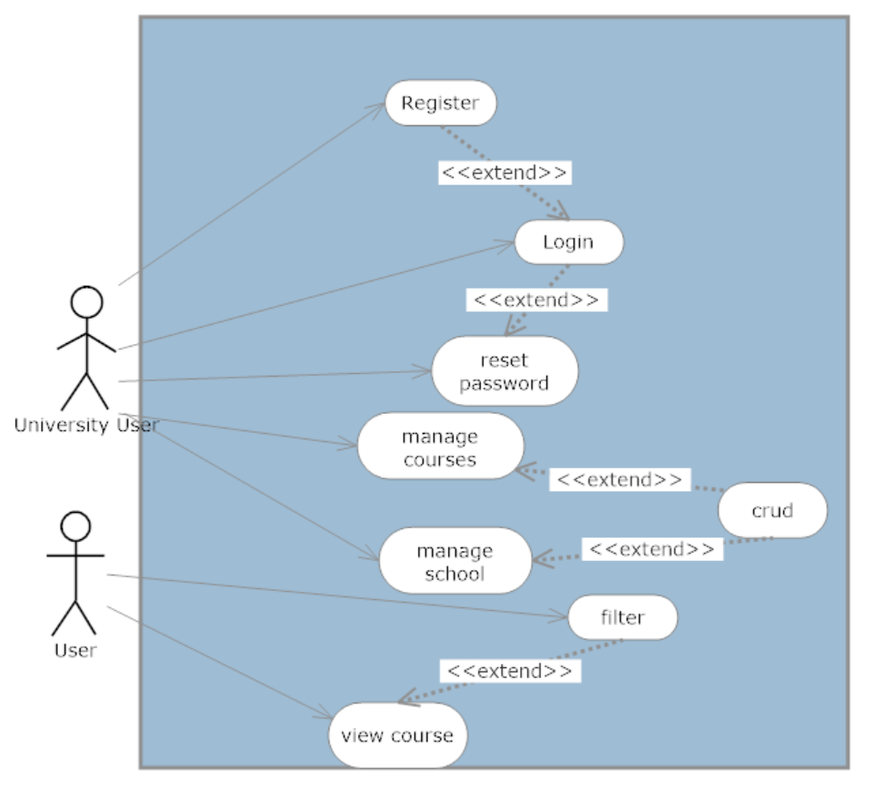
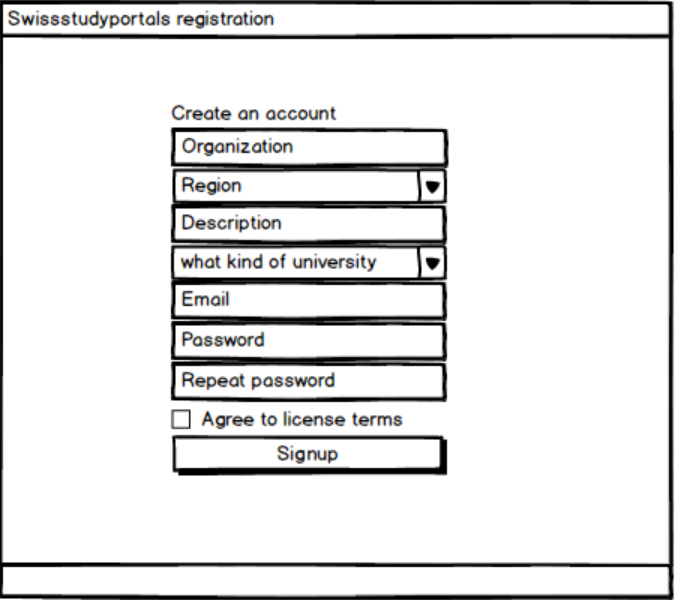
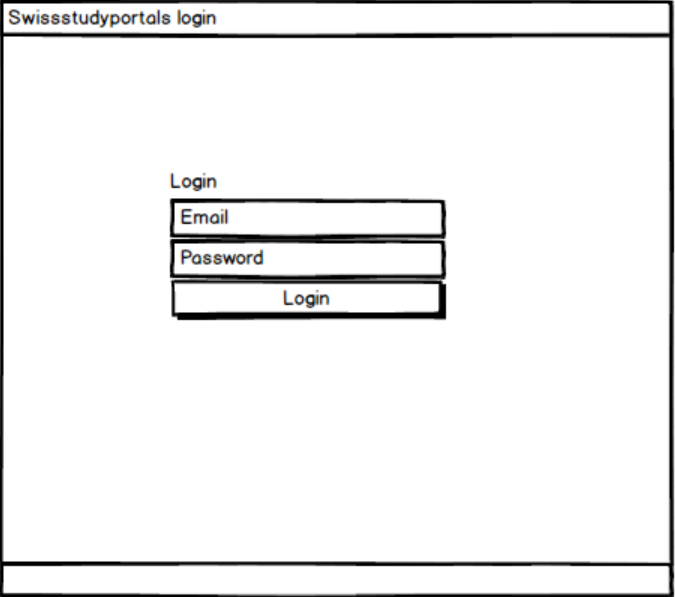
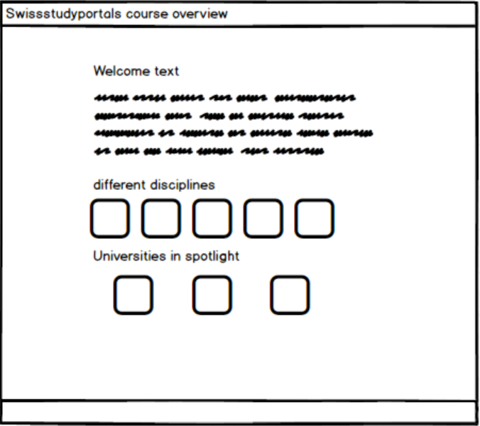
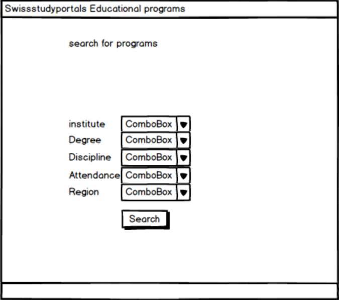
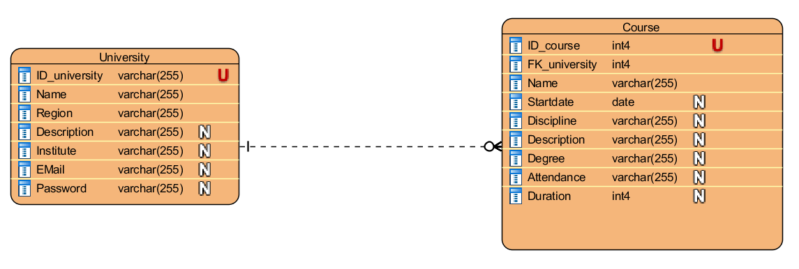
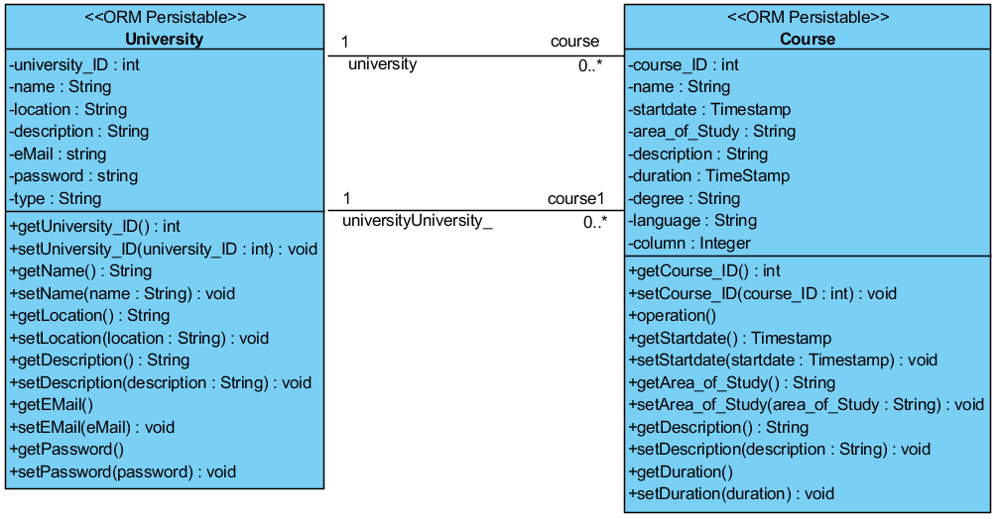
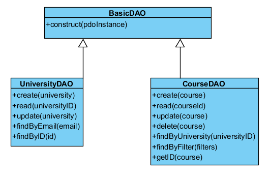

# Swissstudyportal

This is a project elaborated by students for the Web Engineering course of FHNW.

- [Web Engineering Process](#web-engineering-process)
  - [Scenario](#scenario)
  - [Requirement Analysis](#requirement-analysis)
  - [Use case](#use-case)
- [Design](#design)
  - [Mockups](#mockups)
  - [Entity Relationship Diagram](#entity-relationship-diagram)
  - [Domain Model](#domain-model)
  - [Data Access Model](#data-access-model)
- [Implementation](#implementation)
  - [Stage 1: Structure](#stage-1-structure)
  - [Stage 2: Autoloader and Routing](#stage-2-autoloader-and-routing)
  - [Stage 3: Database](#stage-3-database)
  - [Stage 4: Database Access and Domain Objects](#stage-4-database-access-and-domain-objects)
  - [Stage 5: Business Service](#stage-5-business-services)
  - [Stage 6: Register/Login](#stage-6-registerlogin)
  - [Stage 7: Course offerings view frontend](#stage-7-course-offerings-view-frontend)
  - [Stage 8: PDF creation](#stage-8-pdf-creation)
  - [Stage 9: Email Service](#stage-9-email-service)
- [Deployment](#deployment)

## Web Engineering Process 

### Scenario
SwissStudyPortal is a portal designed for students and universities. It allows universities and universities of applied sciences to display their existing further education offers to students in Switzerland. The universities are able to login to the portal and manage their course offers for students. 
### Requirement Analysis
- University users must be able to register.
- University users must be able to login with username and password.
- Data from the registered university users must be stored.
- Passwords for the accounts must be stored securely.
- There must be a database to store course offerings of the universities
- University users must be able to create, read, update and delete their course offerings

### Use Case


  

- UC-1 [Register]: University Users can register to get a profile for their university on swissstudyportals.
- UC-2 [Login]: University Users can login to swissstudyportals by entering their email and password, login is only possible after registration.
- UC-3 [reset password]: University Users can reset their password after they registered for swissstudyportals.
- UC-4[manage courses]: University Users can create, read, update and delete the couses they offer on swissstudyportals.
- UC-5[manage school]: University Users can create, read, update and delete how their school is displayed on swissstudyportals. 
- UC-6[filter]: Users can search and filter the displayed course offers from the universities.
- UC-7[view course]: Users are able to view the course details offered by the universities by clicking on the courses, after filtering for their wished courses.
## Design
### Mockups
 The following picture shows the registration screen of swissstudyportals
 
 
 
 The following picture shows the login page
 
 
 
 The following picture shows the course overview page
 
 
 
 The following picture shows the search interface, where users can filter for their prefered courses
 
 
 
 ### Entity Relationship Diagram
 
 
 
 ### Domain Model
 
 
 
 ### Data Access Model
 
 
 
## Implementation
### Stage 1: Structure
The framework used to structure the system, was offered by our lecturer Andreas Martin. The detailed description of the framework can be found at https://github.com/andreasmartin/WE-CRM.
- At first, a bootstrap based prototype has been created (see mockups above).
- based on the mockups the application bootstrap studio has been used to create the basic UI design based on HTML, CSS and JavaScript. 

### Stage 2: Autoloader and Routing
The autoloader and router and router exception file was created using the methods suggested by our lecturer Andreas Martin.

### Stage 3: Database
The database was created using following code: 
```CREATE TABLE Course (
  "ID_course"               SERIAL NOT NULL UNIQUE,
  "FK_university" VARCHAR(255) NOT NULL,
  Name                   varchar(255) NOT NULL,
  Startdate               date,
  Discipline              varchar(255),
  Description             varchar(255),
  Degree                  varchar(255),
  Attendance              varchar(255),
  Duration                int4,
  Link                      VARCHAR(255),
  Language VARCHAR(255),
  PRIMARY KEY ("ID_course")
);

CREATE TABLE University (
  "ID_university" VARCHAR(255) NOT NULL UNIQUE,
  Organization          varchar(255) NOT NULL,
  Region        varchar(255) NOT NULL,
  Description   varchar(255),
  Institute     varchar(255),
  EMail         varchar(255),
  Password      varchar(255),
PRIMARY KEY ("ID_university"));
ALTER TABLE Course ADD CONSTRAINT FKCourse911790 FOREIGN KEY ("FK_university") REFERENCES University ("ID_university");
```

### Stage 4: Database Access and Domain Objects
In this stage, DAO objects have been created and the database was accessed using PDO functionality. 
Furthermore, we created:
- Classes as well as methods to access the database
- SQL statements to create, read, update and delete data from the database and we added these statements into the PDO environment.
- Domain objects to hold the data from the database.
- In case of failures with the retrieved domain objects, they get stored as arrays
- Added getters and setters to domain objects

### Stage 5: Business Services
In this stage, the business services have been created. 
- Created service classes and methods for the use cases.
- Added business functionality to the methods.
- Backend functionality to display filtered courses. 

### Stage 6: Register/Login
In this stage, the frontend for the register and login functionality have been created.
- Created login and register pages using Bootstrap Studio.
- Converted the pages to php files.
- Added dynamic entries with PHP.

### Stage 7: Course offerings view frontend
In this stage, the frontend for the management of the course offerings has been created.
- Created static HTML pages for viewing, adding and editing courses using Bootstrap Studio.
- Converted the pages to php files.
- Added dynamic entries with PHP.

### Stage 8: PDF creation
In this stage we implemented a tool to generate PDFs.
A pdf file will be generated when a course has been generated.

### Stage 9: Email Service
In this stage, the email service was created. The system will send out emails to users when they register, set up new course offers, and when the user forgot his password. 
Created an account on sendgrid.
Created a class to treat email sending requests. 
Created templates for the emails.
Created a method to reset passwords
Created a page to reset password.
Added dynamic entries using PHP.

## Deployment
The system and postgre-sql database containing the data were deployed on the PaaS platform Heroku. The website is accessible under the following URL:
https://swissstudyportal.herokuapp.com
The source code for the website can be found in this repository. 
